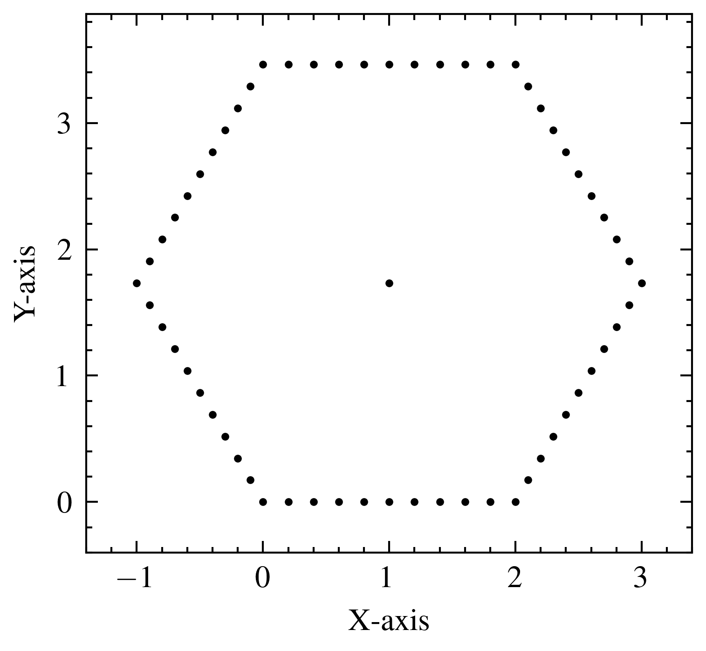
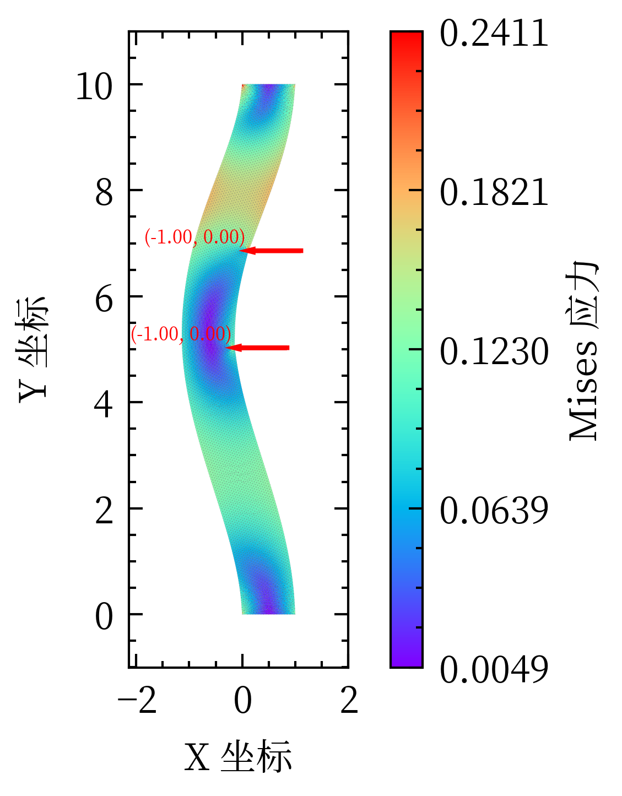

# MiniFEM —— 基于 Python 的轻量二维有限元分析工具

> 一个用于二维平面应力问题的小型有限元分析程序，包含自动三角网格生成、常应变三角单元求解器以及基本的后处理可视化模块。

[](https://www.python.org/)
[](https://docs.astral.sh/uv/)
[](https://github.com/Nouchi-Kousu/MiniFEM/blob/main/LICENSE)

## 快速开始

安装依赖项

```bash
uv sync
```

开始

```bash
uv run main.py
```

## 主要功能

网格自动划分：


计算结果及载荷绘制：
